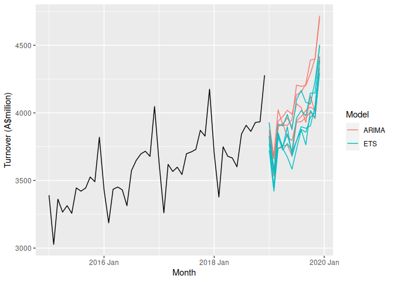
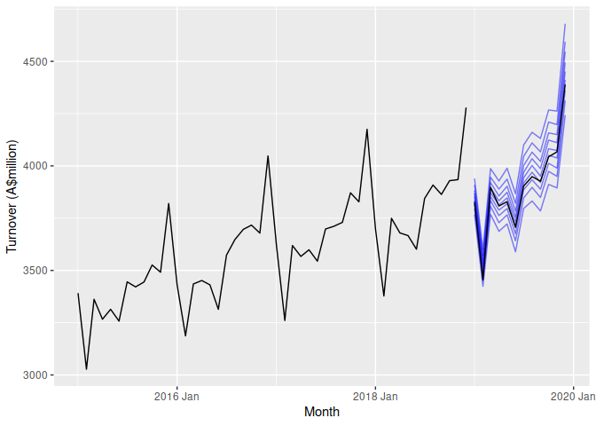

Quantile forecasting with ensembles and combinations
================

Book chapter by Rob J Hyndman.

``` r
library(dplyr)
library(tidyr)
library(ggplot2)
library(tsibble)
library(fable)
library(lubridate)
library(distributional)
set.seed(2020-08-08)
```

First we download the Australian cafe data from the Australian Bureau of
Statistics, and keep 2006-2019.

``` r
cafe <- readabs::read_abs(series_id = "A3349870V") %>%
  select(date, value) %>%
  mutate(date = yearmonth(date)) %>%
  as_tsibble(index = date) %>%
  filter(
    date >= yearmonth("2006 Jan"),
    date <= yearmonth("2019 Dec")
  )
```

We will fit ETS and ARIMA models, and a combination of the two.

``` r
train <- cafe %>%
  filter(year(date) <= 2018)
fit <- train %>%
  model(
    ETS = ETS(value),
    ARIMA = ARIMA(value ~ pdq(d = 1) + PDQ(D = 1)),
    SNAIVE = SNAIVE(value)
  ) %>%
  mutate(COMBINATION = (ETS + ARIMA) / 2)
```

Figure 1: future sample paths

``` r
future <- fit %>%
  select(ETS, ARIMA) %>%
  generate(times = 5, h = "1 year") %>%
  mutate(modrep = paste0(.model, .rep))
train %>%
  filter(year(date) >= 2015) %>%
  autoplot(value) +
  geom_line(data = future,  aes(y = .sim, col = .model, group = modrep)) +
  labs(x = "Month", y = "Turnover (A$million)") +
  guides(colour = guide_legend("Model"))
```



Figure 2: deciles from ETS model

``` r
fit %>%
  select(ETS) %>%
  generate(times = 1000, h = "1 year") %>%
  as_tibble() %>%
  group_by(date) %>%
  summarise(
    qs = quantile(.sim, seq(from = 0.1, to = 0.9, by = 0.1)), prob = seq(from = 0.1, to = 0.9, by = 0.1)
  ) %>%
  ggplot(aes(x = date)) +
  geom_line(aes(y = qs, group = prob), col = "blue", alpha = 0.5) +
  geom_line(aes(y = value), data = cafe %>% filter(year(date) == 2019)) +
  geom_line(aes(y = value), data = train %>% filter(year(date) >= 2015)) +
  labs(x = "Month", y = "Turnover (A$million)")
```



Ensemble combining ETS and ARIMA sample paths

``` r
ensemble <- fit %>%
  select(ETS, ARIMA) %>%
  generate(times = 10000, h = "1 year") %>%
  as_tibble() %>%
  select(-.rep, -.model) %>%
  nest(sample = -date) %>%
  group_by(date) %>%
  summarise(
    .model = "ENSEMBLE",
    sample = list(unname(unlist(sample)))
  ) %>%
  ungroup() %>%
  mutate(
    value = dist_sample(sample),
    .mean = mean(value),
  ) %>%
  select(-sample) %>%
  as_fable(index = date, key = ".model", distribution = value, response = "value")
#> Warning: The dimnames of the fable's distribution are missing and have been set
#> to match the response variables.
```

CRPS calculations

``` r
fcasts <- fit %>%
  forecast(h = "1 year") %>%
  bind_rows(ensemble)
crps <- fcasts %>%
  accuracy(cafe, measures = list(CRPS = CRPS))
snaive_crps <- crps %>%
  filter(.model == "SNAIVE") %>%
  pull(CRPS)
crps %>%
  mutate(skillscore = 100 * (1 - CRPS / snaive_crps)) %>%
  arrange(skillscore)
#> # A tibble: 5 x 4
#>   .model      .type  CRPS skillscore
#>   <chr>       <chr> <dbl>      <dbl>
#> 1 SNAIVE      Test   68.6        0  
#> 2 ARIMA       Test   32.9       52.0
#> 3 ETS         Test   31.5       54.0
#> 4 ENSEMBLE    Test   31.4       54.3
#> 5 COMBINATION Test   30.9       54.9
```
